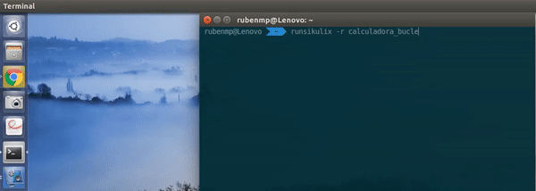

# Presentación SikuliX
Esta es una charla para el Trigésimo cuarto seminario de [LibreIM](https://github.com/libreim).

[SikuliX](http://sikulix.com/) es una herramienta para controlar la interfaz gráfica a partir del reconocimiento de imágenes, para empezar a usarla puedes mirar [aquí](http://sikulix.com/quickstart/).

Para esta presentación no será necesario ni tener instalado SikuliX ni traer ordenador (en caso de querer ejecutar los programas en el propio ordenador el único requisito es tener una interfaz Unity, la que viene por defecto en Ubuntu, ya que los programas son dependientes de la interfaz gráfica), se explicarán los conocimientos necesarios para usar esta herramienta y se programará desde cero.

# Ejemplo
En este ejemplo ejecutamos una macro que hace operaciones aleatorias sobre la calculadora.

